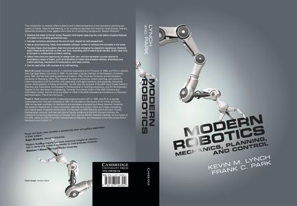
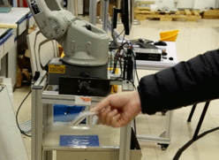
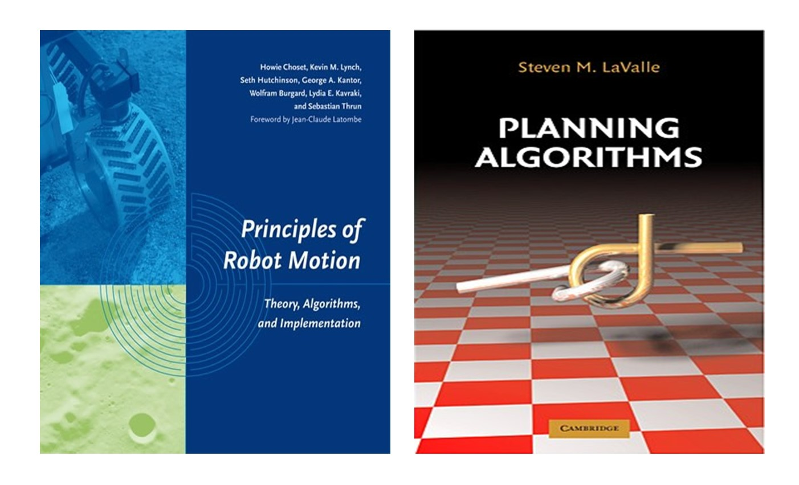
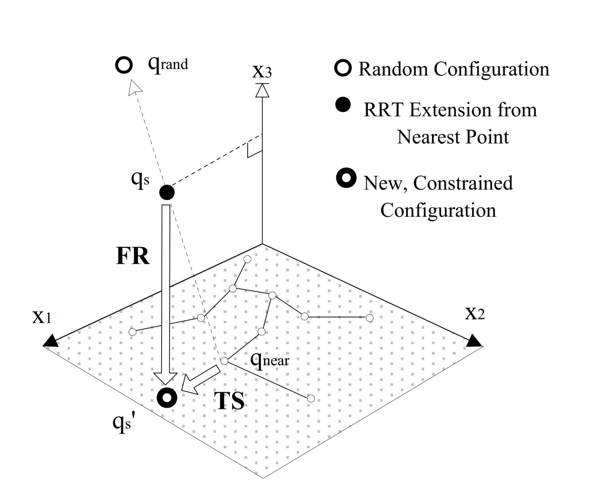
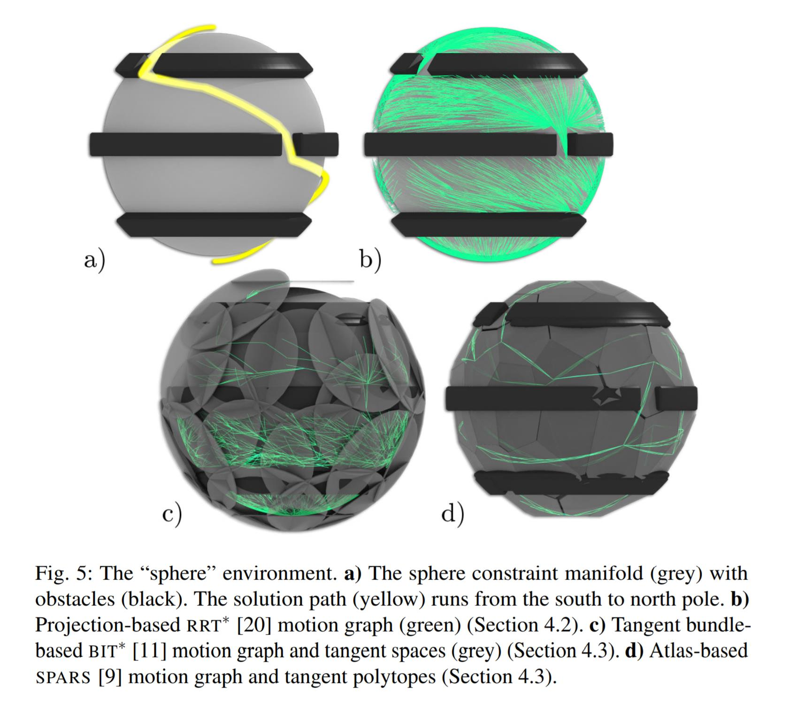

So far, you've been a good robot engineer.  However, if you want to work in research and development, you need to learn more specialized knowledge.  Of course, this part is closely related to your research direction, I can not go into detail.  Just a general introduction.  

In addition, it is highly recommended to get one book named《Springer Handbook of Robotics》[2]。When dealing with a new field, find the corresponding chapter in Handbook, understand the basic outline through it, and use the provided references to quickly fill in the knowledge.  

### 5.1 math

At this point, your basic math doesn't allow you to go any further.  So, you need to supplement your math knowledge.  

- **numerical computation method **：Most of the time, we are using computers to implement the algorithm function, so you must understand the basic numerical calculation methods, such as numerical differentiation, numerical integration, etc.  You can look at 《Numerical Methods for Engineers》[3]

- **convex optimization**：Many of the world's problems are not easy to find analytical solutions, we have to use optimization methods to calculate.  So, you have to know how to model optimization and know how to do it in code.  Here, I recommend the Stanford Open Course  [《Convex Optimization》](https://lagunita.stanford.edu/courses/Engineering/CVX101/Winter2014/about)

- **Lie groups and Lie algebras**：Optimization methods often use gradient information, but sometimes you find that you don't know how to define a gradient.  Lie group Lie algebra is a very classical mathematical tool, which can describe the objects in SO(3) and SE(3) space very conveniently.  At this point, any questions you might have about quaternions, angular velocity, etc., will disappear.  This part of the study materials, I will supplement later. 

### 5.2 Modern Robotics

  

Lie groups and Lie algebras may not be readily acceptable to many engineering students.  Here, I recommend starting with Modern Robotics, which is a very simple textbook for undergraduates.

You can find it [internet](http://hades.mech.northwestern.edu/index.php/Modern_Robotics)，There are also courses on Coursera：[《Modern Robotics》](https://www.coursera.org/specializations/modernrobotics)。

By the end of this course, you will be able to master the new modeling method of Screw, and at the same time, you will find that the modeling of robot kinematics and dynamics becomes so simple and clean.

At this point, you've touched a little bit of Lie groups and Lie algebra.  Then you can go to see some Lie Group Lie Algebra textbooks for engineering students, such as [《Notes on Differential Geometry and Lie Groups, I & II》](http://www.cis.upenn.edu/~jean/gbooks/manif.html)

### 5.3  control 

At this point, you've probably tried to build some robotic platforms and learned some basic control theory.  However, you find that the actual robot is not ideal, and the dynamics model can be very imprecise.  So, you need to get a robot's **parameter identification **。So, you can go to Khalil's textbook《Modeling, identification and control of robots》[4].Among them, you need to know various filtering algorithms (calculating acceleration), various numerical optimization algorithms.  Moreover, if you need to calibrate the kinematic parameters of the robot, you will find that the Lie group Lie algebra is very convenient to define all kinds of related Jacobians.

Now, you have a relatively accurate dynamic model, but you find that you need to give velocity and acceleration constraints when you plan the trajectory of the robot controller.  You sense there's something wrong with that.  Yes, there are no actual speed and acceleration constraints in the robot system. All of our operations are directed at the motor torque.  In other words, we only have torque constraints.

So, the question is: how to make the robot realize the fastest movement under the torque constraint.  Then you fall into the pit of **optimal control**.Here, various numerical optimization methods will be very useful.

Now you can control a single robot, but you find that once the robot is in contact with the environment, it's not enough to just have a model of the robot.  You need to model the environment.  However, the environment cannot be accurately modeled.  So you start learning all kinds of stuff like **force control**, **impedance control**, etc.  In turn, you can implement some of the functions of so-called collaborative robots:[《I heard that collaborative robots are all the rage right now, so I made 1/7 of them》](https://mp.weixin.qq.com/s/hkZjZItqyfwG6k0cwRm9kA)

  

### 5.4 motion planning

Now, you can make the robot do what you want.  However, you feel that the robot is still too difficult to use, you have to manually specify the path points to go through, otherwise the robot may collide with the environment.  You wonder, is it possible for the robot to find these path points on its own.
 
 So you move into the area of motion planning.

A natural thought, of course, is whether it is possible to construct an objective function directly and calculate the desired trajectory in an optimized way.  But sometimes the world is not so lovely.  The motion planning problem is usually a non-convex problem, which cannot be solved directly by optimization.  Therefore, for the manipulator, there can be a variety of sample-based algorithms;  Of course, some people approximate it to a number of convex problems to optimize the solution, in a relatively simple scene the effect is quite good.

For a general introduction to motion planning, see my previous article:[《Motion planning | profile》](https://mp.weixin.qq.com/s/_fE760XxFlvrkzYEpslYvA)。

  

More detailed introduction to the best look at the textbook, such as《Principles of Robot Motion》[5] and《Planning Algorithms》[6] They are all good textbooks.

In addition, this part must be done in conjunction with programming.[The Open Motion Planning Library](http://ompl.kavrakilab.org/) It is a good reference, I believe you have learned more or less about ROS when you are studying ROS.

If you understand it deep enough, you will understand what Lie groups and Lie algebras do.  Such as:

(1) Sport planning is carried out in the Configuration Space, while the Configuration Space of most common institutions is a Lie Group:  Joint space of a multi-joint robot (Torus(n)), unmanned aerial vehicle (SE (3)), and related constraints of an object operated by the end of the robot (SE (3)).  Therefore, as long as we define the basic properties of various Lie groups, we can use a unified planning algorithm to carry out planning.  Specifically, you can see the use of State space in Oompl.

(2) When our planning involves some constraints, such as keeping the end of the robot horizontal (holding a glass of water).  One way is to do it the old-fashioned way.  For example, an implementation in OpenRave:[ConstraintPlanning](http://openrave.org/docs/0.8.2/openravepy/examples.constraintplanning/)，A random point is sampled in joint space, projected onto the nearest task space, and then the random points are connected to the RRT tree in a Jacobian iteration.  

  

But there's another way to look at it.  The terminal attitude of the robot is a SE(3) Lie group.  Keeping the ends horizontal, you can think of it as a semi-direct product of an R3 space with SO(2) space, which is also a Lie group.  So, we can run an RRT directly within the Lie group or across the Tangent Space, for example : Tangent Bundle RRT[7] 与 AtlasRRT[8]

  

### 5.5 machine learning

Much of the previous work is about modeling + identification.  There's actually a whole other class of work that is data-based, that is, to give a general model, to use data for learning fit.  It's called machine learning.

For this, my personal learning path is as follows:

- Ng's  [《Machine Learning,on Coursera》](https://www.coursera.org/learn/machine-learning)，Understand the basics of machine learning.

- Geoffrey Hinton 的[《Neural Networks for Machine Learning》](https://www.youtube.com/playlist?list=PLoRl3Ht4JOcdU872GhiYWf6jwrk_SNhz9)，It used to be on Coursera, but now it seems you can only find it on YouTube.  In this course, we can basically go through some classical neural networks.

- Various open source platforms.  With this in mind, and having implemented several classic machine learning algorithms in Matlab, you are ready to try out some deep learning open source platforms, such as [TensorFlow](https://www.tensorflow.org/).There are a lot of people doing machine learning, so there's a lot of material, so it's very easy to learn on the Internet.

Of course, it's important to remember that we didn't learn machine learning to switch to DL, but to use it to provide tools for robotics research:

- Intelligent control: I believe that those who have learned intelligent control should remember the application of network such as cerebellar model in control;

- Modeling: For some difficult modeling, sometimes you can try machine learning methods, such as using neural networks to fit friction;

- Vision: Robots need to be combined with vision, and DL is developing rapidly in the field of vision. Sometimes using this tool, experimental prototypes can be built very quickly.

- Reinforcement learning: this is introduced in the next chapter.

### 5.6 reinforcement learning
If you have studied reinforcement learning, you will be impressed by its minimalist theory: all theories derive from a Bellman equation. Moreover, reinforcement learning is very intuitive. Therefore, many people believe that reinforcement learning is the future of robots.

I have no further comment on this. I'll just give you a rough introduction to reinforcement learning.

First of all, reading books. Sutton 's《Introduction to reinforcement learning》[9] It's kind of a required Bible reading.

You can find the Python version of the algorithm on GitHub [Python Implementation](https://github.com/ShangtongZhang/reinforcement-learning-an-introduction)

Reading Sutton's book, you can learn step-by-step how to derive methods such as Dynamic Programming, Monte Carlo, TD Learning from the original Bellman equations.

You know reinforcement learning is learning to get a lookup table from State to Action/Value through trial and error.

So, you say, well, is it possible to simplify this lookup table, and so, you know that there's Function Approximation. If this approximation function is a neural network, then it is the popular Deep Reinforcement Learing now.

Of course, none of this matters. It is important to understand Markov Decision Processes. You will find that it can be used to solve not only motion planning problems (DP ≈ Dijkstra, Monte Carlo ≈ RRT), but also task planning problems.

### 5.7 The latest paper
At this point, you should be able to read most of the latest papers. So you should follow conferences like RSS, ICRA, IROS, etc., to keep abreast of the latest developments in robotics. Learn the latest theories through IJRR, TRO and other periodicals.

Of course, you can also subscribe to Google Scholar and it will send the latest papers to your email occasionally.
