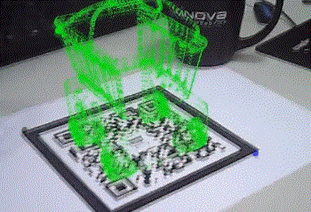
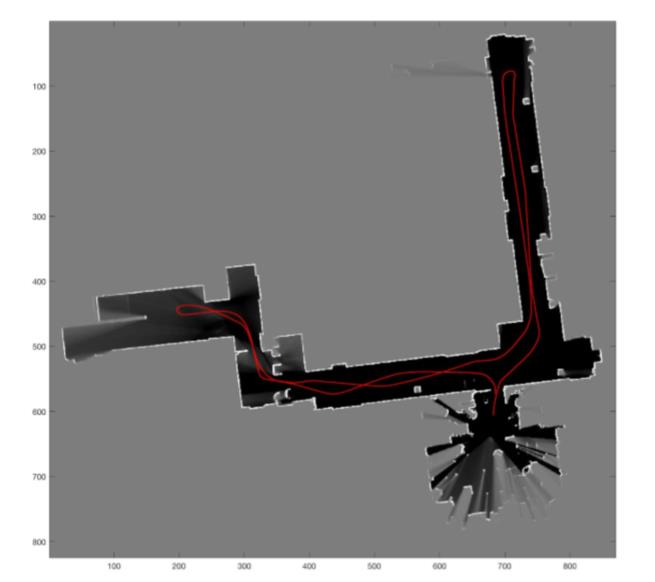

After reading Craig's book, you should have a general idea of how industrial robots work, but you have little hands-on experience with how to apply what you read in the book to real robots.  Robotics, after all, is a practical subject. It remains theoretical, not only useless, but also uninteresting.

**Get your hands dirty!**

### 4.1 start work

If you are an undergraduate student, it is highly recommended to participate in some competitions, such as Robomaster, Freescale intelligent car competition, electronic design competition, etc. You can also join some of the university's science and technology organizations, such as Tsinghua's Sky Factory. Mainly be familiar with all kinds of electronic circuits, cultivate hands-on ability.

However, in my observation, many science and technology competition masters are often weak in theoretical study. This is mainly because technology competitions are about systematic abilities, and it's little tricks rather than theoretical knowledge that determines the outcome of competitions. Also, the game tends to create a false sense of fulfillment, of being busy every day, but perhaps just repeating the menial tasks. These two reasons can easily lead people to fall into local minima, and it is impossible to make further progress in theory.

So here's my half-baked tip: for competitions and student tech events, two full experiences are enough. Then the focus should quickly shift to theoretical learning.

If you have robot hardware nearby, you can also play with it, or play with realistic robots in RobotStudio/ VREP /Gazebo.

### 4.2 Penn's Robotics Specialization

After that, you might as well take out a few months time, look at the university of Pennsylvania on Coursera [Robotics](https://www.coursera.org/specializations/robotics)  special course.  This special course is not related to mechanical arm or industrial robot, but because robots are interrelated in many aspects, it is highly recommended to take a look.
 
 - Aerial Robotics: This course mainly introduces the control problem of quadrotor UAV, among which trajectory planning, attitude description and control are very helpful to the learning of manipulator arm.  Moreover, the homework quality of this course is also very high, providing numerical simulation module based on MATLAB, which can let beginners intuitively see the control effect of their code.
 
 - Computational Motion Planning:  The level of this course is not as good as the previous one, but through this course, we can know that there is Motion Planning in the robot. Meanwhile, the homework also includes basic Motion Planning algorithms such as handwritten A*, PRM, Potential Fileds, etc.  You can also get an overview of the basics of Collision Checking.
 
 -Mobility: This part mainly introduces the control problem of the foot robot.  Through this course, on the one hand, I can have a general understanding of the development of foot robot control, so that I won't be so confused when I watch the video of Boston Dynamics.  At the same time, more importantly, understanding the relationship between robot modeling and control: a simplified model may also be very helpful to control.
 
 -Perception: This is a very good class, basically introducing camera models, multi-view geometry, things like that.  This content can be very helpful for your future research in SLAM, 3D vision, calibration and other aspects.  And when you're done,  You can make similar  [《the AR principle demonstration》](https://mp.weixin.qq.com/s?__biz=MzA5MDE2MjQ0OQ==&mid=2652786307&idx=1&sn=e71bbca67c7fa69081e863b62b9fd5b4#rd)
 
 

  

- Estimation and Learning：This course starts from Gaussian distribution, and introduces Kalman Filter, Particle Filter and other tools that are very useful in robot state estimation.  Also, the course's major assignment will allow you to write a 2D map reconstruction program from scratch, so you can see how to use laser sensor information to get 2D maps like the following.

  

### 4.3 ROS

So far, you have a more complete context of the basic knowledge of the robot, and also use MATLAB to achieve some interesting algorithms.  However, as you find out, the robot is a very large system, and as a beginner, it is not possible to start from scratch and build the various algorithm modules required by the robot step by step.  It's time to embrace the great open source world.
 
 As many of you may know, there's an open source project called the Robotic Operating System  [(Robot Operating System, ROS)](https://wiki.ros.org/)。

There are probably a lot of tutorials online for learning ROS.  However, I feel that many students majoring in electromechanical and automation are not suitable for directly starting to watch ROS.  Because they lack basic knowledge of Linux and C++.  Therefore, I recommend following the following steps:

- **Linux**：If no Linux development experience, I suggest install Ubuntu system first, and then look at [UNIX Tutorial for Beginners](http://www.ee.surrey.ac.uk/Teaching/Unix/),  Familiar with basic Linux usage.  

- **Github**：Most of ROS's projects are hosted on [GitHub](https://github.com/).  Therefore, it is very necessary to learn to use GitHub, learn to manage their own code with Git.  It can also be modified for open source projects.  For example, you can just  as I did [remove extra semicolons] (https://github.com/stack-of-tasks/pinocchio/pull/672).

- **Basic C Programming**：If you have not systematically studied C++, it is recommended to make up this part first, because the main code of ROS is implemented in C++. Here, I recommend the school tsinghua university online Zheng Li teacher of course [c + + language program design basis](http://www.xuetangx.com/courses/course-v1:TsinghuaX+00740043X_2015_T2+sp/about) and [c + + Advanced language program design] ((http://www.xuetangx.com/courses/course-v1:TsinghuaX+00740043_2x_2015_T2+sp/about)). Of course, when you learn c + + could proceed in Ubuntu, install a [Visual Studio Code] (https://code.visualstudio.com/) is a good choice.

- **data structure**：In fact, the above basics should be enough for you to learn about ROS, but, for future study, you can learn some data structures in due course. The data structure, I recommend the online Qinghua teacher Deng Junhui [the data structure (top)] (http://www.xuetangx.com/courses/course-v1:TsinghuaX+30240184+sp/about) and [the data structure (bottom)] (http://www.xuetangx.com/courses/course-v1:TsinghuaX+30240184_2X+sp/about).

Now, you can go and see ROS.  As open source projects, I think the best tutorial is website tutorial [ROS Tutorials] (https://wiki.ros.org/ROS/Tutorials).
 
 First of all, learn the basic communication mechanism of ROS through Beginner Level and Intermediate Level, and learn to use Catkin, Roslaunch, RVIZ and other basic tools.
 
 After that, you can look at different modules according to your research interests.
 
 If possible, the learning speed can be greatly improved if the research can be carried out in collaboration with some well-supported ROS platforms.  TurtleBot, Baxter, Universal Robot, etc.  It depends on each person's qualifications.
 
 In theory, in a ROS environment, you can do most of the research that has nothing to do with real-time control, such as SLAM, Navigation, Motion Planning, etc.  If you're doing something even more low-level (like controller design), ROS isn't up to it right now.  (If you're not sure why, review your knowledge of real-time operating systems, robot control.)
