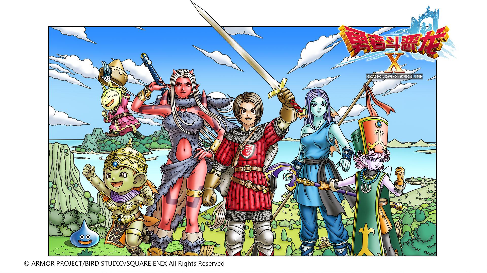
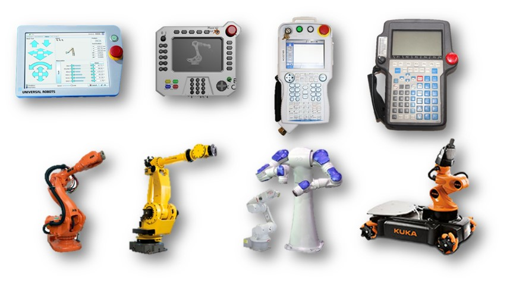
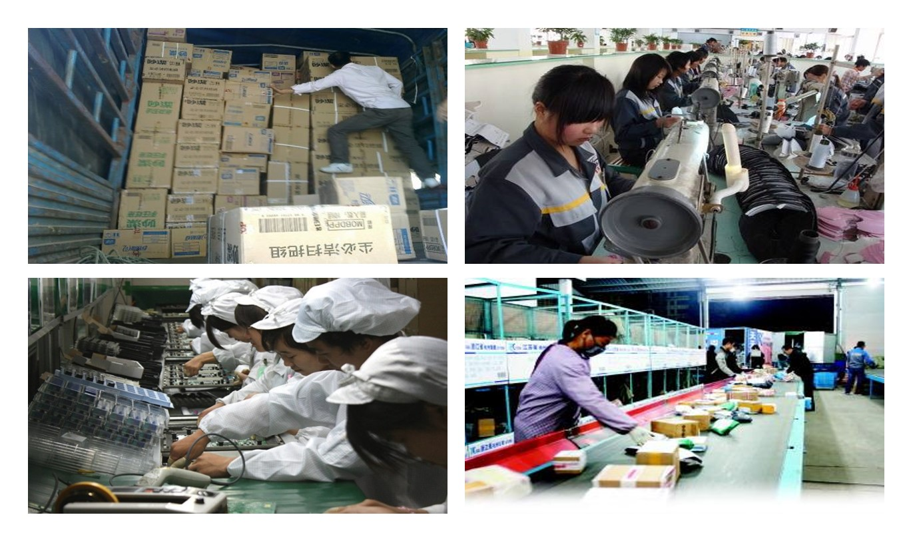

  

Now that you know how to make a robot move, you have a deep knowledge of a particular area of the robot.  Then, like a brave man who has just killed the first Slime, you hold up your sword, ready to plunge it into the dragon's chest.
 
But then someone runs up and throws a basin of water over your head:
 
Now any company, with a little money, can get a robot drawn, process it in a factory, buy some motors, reducers, and so on, put on a universal controller, and you can run.  You don't need dynamics, optimal control, or motion planning!
 
Even for the four people, DH is enough for robot modeling. At most, they can do some kinematics calibration and dynamics identification, and pay more attention to application integration.  You don't need Lie groups, Lie algebras, convex optimization, and reinforcement learning.
 

**「There are no dragons in this world!」**

However, I would argue that in the case of robots, as long as manual labor such as agriculture and industry is not fully automated, the dragon exists:

  

When you see most robots being taught this way, little by little, you have a strong feeling: 「This is the dragon!」

  

When you look at so many robotics companies around the world, with their disparate programming languages and teaching tools, you have a strong feeling: 「That's the dragon!」 

  

When you see a lot of people of my age who are doing heavy work and boring work in factories, you have a strong sense of 「this is a dragon!」 " Yes, in the field of robotics, there are very many dragons. So you picked up your sword and went on your way.

Suddenly, you realize that all you've learned is how to kill 「**a spherical dragon in a vacuum**」, and you don't know how to kill a real dragon.
 
So, you should keep studying.  Find more Slimes to practice with and apply what you've learned on the battlefield.
 
Later, you encounter a new problem, your old sword is not "industrial strength" :  ROS, often collapse, have Orocos processing [Eigen Alignment] (http://eigen.tuxfamily.org/dox/group__TopicStructHavingEigenMembers.html), not to use 3 d  Sensors, industrial robots do not open the underlying interface, and so on.
 
Then you realize you need to rebuild your real sword.
 
However, you can not do this alone, you need a team, someone to dig coal, someone to make steel, someone to hammer iron, someone to sharpen knives......
 
Take a look at [RVBUST](http://rvbust.com/).
 
 
 
