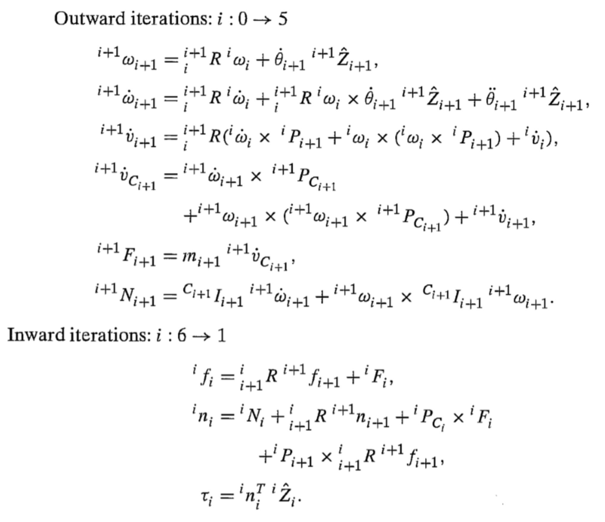

For the introductory part, it's really about figuring out how to get an industrial robot moving.  It's a very well-studied area, and if you look at textbooks from the last century, I recommend John Craig's textbook   《Introduction to Robotics: Mechanics and Control》[1]，在 [Youtube](https://www.youtube.com/watch?v=0yD3uBshJB0&list=PL64324A3B147B5578) 和[网易公开课](http://open.163.com/special/opencourse/robotics.html)You can find a video of Oussama Khatib at Stanford, which is pretty much in line with Craig's textbook.

  

It is recommended to start with Craig's textbook in English. Google it and you can easily find the PDF version. As a primer, Craig's textbook is fairly straightforward, and along with Khatib's video, it's a quick way to pick up the basics of robotics.

I often say to freshmen, "If you have mastered the content of this book, you will be better than most of the seniors in the laboratory."

However, there are not many who really chew down the teaching materials.

So, I'm going to rephrase it here, "If you master the content of this book, you can do the development work of most robot companies in China."

I'm going to outline the basics here, but time is limited, so I won't go into it too much for now. The order may not be exactly the same as in the Craig book.

### 3.1 spatial alternation 

For this part of the content, if you are good at theoretical mechanics, basically is not too big a problem. The problem is, some people don't learn well.

Of course, the homogeneous transformation and so on is a very fundamental and important part of robotics. Among them, we should pay attention to the following:

- Be familiar with coordinate representation: the pose of coordinate system {B} under coordinate system {A} is $${^A_B}T$$ ；
  
- The difference between left-multiplied and right-multiplied matrices;

- Understand the meaning of each column of the rotation matrix, and learn how to write the rotation matrix between two coordinate systems by "visual inspection";
  
- Expressions of gestures:  RPY Angle, various Euler angles, angle-axis expression, rotation matrix, in addition to the content of the book, you can look at the Quaternion (Quaternion) expression by the way, understand the Gimbal Lock of Euler Angle (know the problem of three-parameter representation, it is easier to accept the new things like Quaternion);  
  
- If possible, try to understand the angular velocity.

### 3.2 Kinematics

  

For robots, one of the basic tasks is to calculate kinematics:

- Forward kinematics: according to the joint Angle, the position and pose of the robot tool coordinate system (end) under the robot base coordinate system (base) are calculated;
- Inverse kinematics: Given an end pose, calculate the joint Angle reaching this pose.

Earlier, you saw that you can describe the relationship between two coordinate systems in terms of a 4 by 4 matrix. For the forward kinematics of the robot, if we know the coordinate transformation between each of the links, then we can calculate the final terminal pose by matrix multiplication.

To facilitate the calculation of the relative pose between two links, you need to learn a modeling method called DH. In short, each joint coordinate system is set up according to certain rules, and each coordinate system can be determined with four parameters (DH parameters).

And of course, if you look on the Internet, you'll find that there are several types of DH, like Standard DH, Modified DH, etc.

It doesn't matter, you just know that it helps you determine the relative relationship between the two links. Just master the one in Craig's book (Wikipedia calls it Modified DH) :

  

1) Establish the coordinate system:

- $$z_i$$ axis coincides with the joint of the first  $$i$$ and the rotation direction of the joint is in accordance with the right hand law;  

- $$x_i$$ parallel to $$z_i$$ and $$z_{i+1}$$ male vertical ：$$x_i = z_i \times z_{i+1}$$。If two  $$z$$ axis parallel, then let the $$x_i$$ from $$z_{i}$$ point to $$z_{i+1}$$；

- With $$x$$ and $$z$$ axes, you can define the direction of the $$y$$axis using the right hand law.  

- In addition to the coordinate system fixedly attached to each joint, it is possible to fixedly attach two additional coordinate systems on the robot base {B} and the end tool {E}.  

2）Calculate DH parameters:

- $$a_i$$ is the distance from $$x_i$$，Distance from $$z_i$$ to  $$z_{i+1}$$ ；

- $$\alpha_i$$ is around $$x_i$$，Angle from $$z_i$$ to $$z_{i+1}$$；

- $$d_i$$ is along  $$z_i$$，Distance  from $$x_{i-1}$$ to $$x_i$$ ；

- $$\theta_i$$ is around $$z_i$$，Angle from$$x_{i-1}$$ to $$x_i$$ .

3）Calculate the transformation matrix:

$${^i_{i-1}}T = Rot(x_{i-1}, \alpha_{i-1}) \cdot Trans(x_{i-1},a_{i-1}) \cdot Rot(z_i, \theta_i) \cdot Trans(z_i, d_i)$$

$${^i_{i-1}}T=\begin{bmatrix}cos(\theta_i)&-sin(\theta_i)&0&a_{i-1}\\sin(\theta_i)cos(\alpha_{i-1})&cos(\theta_i)cos(\alpha_{i-1})&-sin(\alpha_{i-1})&-d_isin(\alpha_{i-1})\\sin(\theta_i)sin(\alpha_{i-1})&cos(\theta_i)sin(\alpha_{i-1})&cos(\alpha_{i-1})&d_icos(\alpha_{i-1})\\0&0&0&1\end{bmatrix}$$

4）positive solution ：

$${^b_e}{T}={^b_1}T\cdot{^1_2}T\cdot{...}\cdot{^n_e}T$$

5）inverse solution ：

By constantly adjusting the positions of the matrices above (left multiplication and right multiplication), we try to find the unknowns that can be solved separately.  Although some tedious, but you beginners must personally push a six-axis manipulator inverse kinematics formula, and **programming to achieve**.  

### 3.3 jacobian matrix 

The Jacobian $$J$$ is a very important thing in robotics.It represents the relationship between the robot joint velocity  $$\dot{q}$$ and the terminal velocity  $$\dot{x}$$ :

$$\dot{x}=J\cdot \dot{q}$$

- If you didn't figure out angular velocity earlier, I suggest you think about it in this chapter. For example, 「Why can't we just take the derivative of the Euler Angle and get velocity?」 ;

- Understand the Jacobian calculation method in the textbook, and think 「Can we directly take the partial derivative of the result of the forward kinematics solution?」

- Here is the need to master its calculation method, **must** programming to calculate the Jacobian matrix of the robot;

- If you use Matlab or Python, you can use their symbolic arithmetic tools to test some of my above questions. And that will give us a better understanding of the angular velocity.

- (PS: It's normal that the attitude and angular velocity are not intuitive, because they're not in Cartesian space, and you'll understand them later in more math.) ;

- If you know the principle of virtual work, then you will know that the Jacobian can also represent the relationship between the end forces and joint torques (useful for later force control, etc.).

Now, when you have the Jacobian, you realize that you know how to control the end motion by adjusting the Angle. Now let's go back to the problem of inverse kinematics. And you say, 「Why don't you just move the end of the robot towards the target position?」 .

  

<!-- TODO: update this pic -->

Yes, that's how the kinematics of a robot is numerically calculated, and you can use this method to write a general algorithm for solving the kinematics of a robot.  See my answer on zhihu for details   [MATLAB机器人工具箱中机器人逆解是如何求出来的](https://www.zhihu.com/question/41673569/answer/129670927)。

Beginners **must** hand to implement this algorithm, or some pit need to step on.

Sure, this approach is neat, but it has its own problems:

- The calculation speed is slow and requires multiple iterations;

- Only one solution can be returned at a time;

- Singularities may be encountered, and the result cannot converge.

At this point, you can also take a look at some of the problems with Singularity, understanding that Singularity is a configuration-related property of robots that cannot be modulated away.

### 3.4 Dynamics

I believe that 80% of people give up at this chapter.

  

For the dynamics of multi-axis robot, whether using Newtonian Euler or Lagrange method, it will be extremely complicated. In addition, if you have not learned theoretical mechanics well before, it is basically difficult to walk.

Therefore, I personally think that it is necessary to have a basic concept of this part first, and not directly touch the dynamics of six-axis robot for the time being:

- Able to use Lagrange method to calculate the dynamics model of the three-axis manipulator (the solution of the three-axis is within the acceptable range);

- The Newton Euler method is used to calculate the dynamics model of the three-axis manipulator, which must be realized by **programming** (because in the case of high degree of freedom, the Newton method is easier to be realized by programming, and if you want to do dynamics in the future, it is more likely to use Newton Euler, rather than Lagrange);

- Understand the physical meaning of the moment of inertia, (in the above programming process, there will certainly be corresponding problems, such as the angular velocity and the reference coordinate system of the moment of inertia);

- Have a general understanding of the robot dynamics (formula form, linkage dynamics, joint dynamics, gravity effects, joint friction, motor dynamics, etc.).

### 3.5  Control

So now that we have the tools to solve the kinematics of the robot, we know what the joint angles are to get the robot to any state. But how do you get these joints to move?

First of all, we need to know that our everyday world is still governed by Newtonian mechanics.

$$F = m \cdot a$$

To make something move, you have to apply force to it.

  

If we give a slider the trajectory of $$s(t)$$， we can calculate the acceleration of the entire trajectory of  $$\ddot{s}(t)$$，and then calculate the force required to make the slider move as we expect $$F(t) = m \cdot \ddot{s}(t)$$。

In other words, we can use dynamics to calculate the torque of each joint required to make the robot move.  

  

The joint torque, on the other hand, can be supplied by a motor. For a DC motor, the output torque is proportional to the current.
 
 However, there are a few problems:

- dynamics are hard to calculate; 
- the dynamic parameters are not good (the inertia quantity is not good, the joint friction is not good). 
- there may also be various external forces (those who hold, etc.). 
This is the work of the control algorithm. So, you will be exposed to the legendary pid control. 
However, there is a problem: if we send the target location directly to the pid controller, each time is a step response. 

  

Here, it is recommended that conditional partners use single-chip microcomputer to get a single-axis servo control system, with a servo motor (you can control the current, torque, or PWM duty cycle; Stepper motor, steering gear), encoder (can feedback the Angle of the motor), driver (can convert digital instructions into motor control signals), controller (STM32 and other single chip microcomputer, can provide control instructions to the driver). By the way you can understand some communication, interruption, real-time content.

Still, it felt like something was wrong. The robot was moving as if it were accelerating and decelerating (right), not as if it were a step (left).

  

This is Trajectory Planning. Given a number of Trajectory points, different functions are used to fit these trajectories.  
 
Then you think, since both PID and dynamics can calculate the force required to make the robot move, but the dynamics is slightly inaccurate, is it possible to combine them together, first using the dynamics to calculate a basically accurate torque, and then using PID to eliminate the minor errors caused by the inaccuracy?  

  

Yes, so you found the dynamic feedforward PID control algorithm.
 
The rest of the rest of Craig's book, you can skim it, because a lot of it is old.
