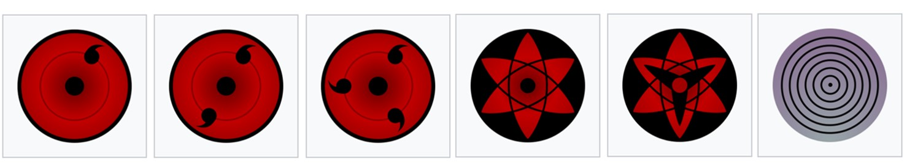

Of course, the pre-study knowledge will change with the deepening of the study, especially mathematics. Mathematics is like writing the wheel eye. When looking at the same stone tablet, different levels of "writing the wheel eye" will see completely different content.

  

Can only add, subtract, multiply and divide, can be engaged in robot debugging engineer;
Linear algebra, calculus, can master kinematics, dynamics modeling and other basic content;
By learning computational methods, convex optimization, differential geometry, you can participate in some identification, planning, learning work.

But because robotics is so broad and requires very different basic knowledge in different directions, it may not pay to get bogged down in "pre-learning" at the beginning.

Therefore, I think, we can list some basic knowledge first, and the others can be mentioned in the following corresponding parts:

1. **Basic English skills**：In terms of robotics, there is basically no very suitable Chinese textbook to recommend at present.The teaching materials that write profound and simple are mostly foreign, everybody**must**Learn to read English textbooks.This process must be painful at first, but, basically, after a month you will get used to it.。

2. **Learn to use VPN**。For the same reason, almost all useful materials need to be accessed via Google or YouTube。

3. **Linear algebra**：All spatial transformations and robot-related calculations rely on linear algebra, and even some basic "linear space" thinking is required.For linear algebra, I'm going to recommend Prof. Gilbert Strang's 《Linear Algebra》，Here [Youtube](https://www.youtube.com/watch?v=hNDFwVVKVk0&list=PL221E2BBF13BECF6C) and [NetEase Open Class](http://open.163.com/special/opencourse/daishu.html)You can find the video here.The course starts by introducing you to the spatial perspective, not just the calculation.Also, the netease open class has Chinese subtitles, which is relatively beginner friendly.

4. **Calculus**：Everything in the robot that involves derivatives, integrals, optimizations, you have to use calculus.Therefore, this math class is also from the beginning of the inevitable.I don't have a good video recommendation, so you might as well watch  Gilbert Strange's [《Calculus highlights》](http://open.163.com/special/opencourse/weijifen.html) ([Highlights of Calculus](https://ocw.mit.edu/resources/res-18-005-highlights-of-calculus-spring-2010/))？

5. **Theoretical mechanics**：Robotics is about working with forces every day.However, mechanical theories such as space transformation, virtual work principle, Lagrange and so on are not carefully deduced in general robot textbooks, and these things are relatively abstract, so many beginners' self-learning process is cut off in the chapter of dynamics.Of course, I do not have good recommendation materials for this part. There is a teacher from Tsinghua University, Gao Yunfeng, on the school online [《theoretical mechanics》](https://www.xuetangx.com/courses/TsinghuaX/20330334X/_/about)Open class, also can refer to.(But at least I always felt sleepy in his classes.)。
<!-- TODO: Improve <<theoretical mechanics>>  -->
   
6. **Matlab or Python**：Both are very easy to use programming languages that are very convenient for data visualization.
In the process of learning robotics, you can easily implement some algorithms through this kind of scripting language, which can be used to verify your derivation results.
Of course, these two parts only need to master the basic matrix operation and visualization operation can be.Other more advanced usages can be learned later.It's easy to find introductory courses in both languages on Coursera [Matlab](https://www.coursera.org/learn/matlab)、[Python](https://www.coursera.org/specializations/python)。

7. **Theory of control**：Robotics is about control, but robotics textbooks don't usually talk about that much.Of course, most industrial robots are still using relatively simple algorithms.However, as a researcher, it is necessary to understand some basic control theories, such as PID, equation of state, observability, controllability, Lyapunov, optimal control, a little nonlinear control and a little intelligent control, etc.You can watch this part on YouTube [Brian Douglas](www.youtube.com/channel/UCq0imsn84ShAe9PBOFnoIrg) 。

  

8. **Digital and analog circuits**：Robotics is a practical science, and you only know it when you code the formulas you derive and get the actual robot to do what you want it to do.A knowledge of digital electrodynamics will give you a basic understanding of logic circuits, so that you will not even know why there is a driver in front of the motor.At the same time, when there is no actual robot around, it is also very convenient to build a small circuit to do some control experiments.This knowledge can look for this teaching material casually, what I use at that time for example is the teaching material of teacher tang qingyu.

9. **A little chip microcomputer**：If you want to build a simple control circuit, it is not enough to only have the knowledge of digital electricity and electricity, but also to be able to convert these knowledge into the actual circuit, and can run the control code, then you need to know the SCM.For MCU, you can buy some minimum system board with servo motor control course online and learn Arduino or STM32. Of course, it is best if you can participate in Robomaster or Freescale intelligent car race, so that you can have a basic understanding of each embedded module.

10. **Linux and C language**：Now that we have the circuit part, we need to turn the formula code into the circuit instructions, which involves embedded programming.This piece of advice is to learn a little C.Embedded C requirements are actually not high, just learn some grammar enough, for example[《C语言入门》](https://akaedu.github.io/book/pt01.html)。However, if you want to do some higher level work in the future, you'd better learn C well from the beginning.Learn programming, Linux is a good choice, so at this time, you can try to install a Linux system, learn C language above.

11.  **Basic 3D design**：In the production of experimental platform, we often encounter the need to process and design small parts. At this time, mastering a 3D design software can greatly improve the development speed, such as SolidWorks is a good choice.With tools such as a 3D printer, rapid prototyping can be achieved.(Even if you don't have a 3D printer, it's easy to find a 3D printing service online and just send in your designs.)

The above knowledge is basically an automation major or electromechanical major junior students should achieve the level.Once you have a basic understanding of the above sections, you can begin to look at robotics.
